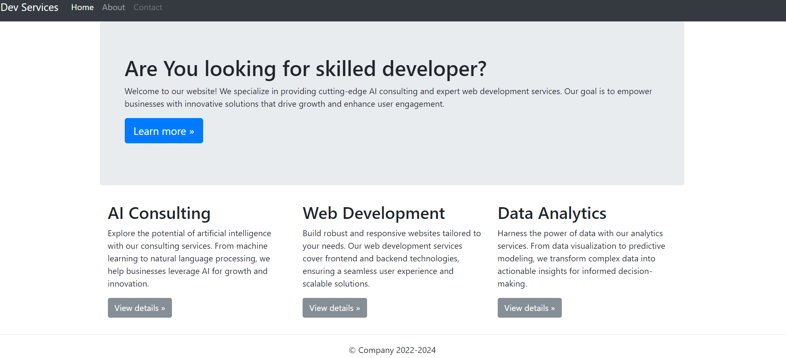

# Express.js Project Template

This is a simple Express.js project template using Node.js and Pug templates for a website.


## Getting Started

### Prerequisites

Make sure you have Node.js installed on your machine.

### Installing Dependencies

```bash
npm install
```

### Starting the Server

```bash
npm start
```

The server will run on `http://localhost:3000`.

## Project Structure

```
.
├── app.js                   # Main application file
├── node_modules/            # Node.js modules (generated)
├── public/                  # Static files (CSS, images, etc.)
│   └── stylesheets/
├── views/                   # Pug templates
│   ├── index.pug
│   ├── about.pug
│   └── contact.pug
├── .gitignore               # Git ignore file
└── README.md                # This file
```

## Running Tests

There are currently no automated tests for this project.

## Deployment

This project is not configured for production deployment. Consider enhancing security and configuration settings before deploying to a production environment.

## Built With

- [Node.js](https://nodejs.org/)
- [Express](https://expressjs.com/)
- [Pug](https://pugjs.org/) - Template engine
- [nodemailer](https://nodemailer.com/) - For sending emails

## Authors

- Aridal Sami

